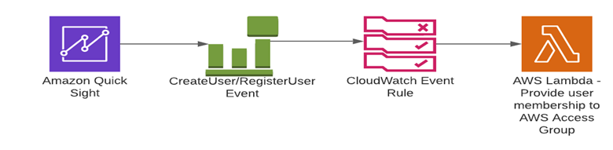

# Overview

This project will give you an overview of the process to add users to an Access Group in QuickSight to maintain required permissions on the QuickSight Dashboards.

## Main use cases 
1. Add users to an existing QuickSight Access Group.

2. Create QuickSight Access Group if not already existing and give required permissions to this Access Group on the newly created Dashboard and on other already existing Dashboards where Access Group does not have permission.

## Trigger
-  QuickSight RegisterUser or CreateUser event
-  QuickSight CreateDashboard event

# Proposed Structure

The following diagrams shows that if we capture CreateUser or RegisterUser event via CloudWatch Event Rule and trigger the Lambda function to provide membership of an existing AWS Access Group to the user.

1. User Registering/Creating into the quicksight dashboard.
2. Defined Cloudwatch rule for CreateUser/RegisterUser.
3. It triggers lambda function for CreateUser/RegisterUser event.
4. Finally lambda will made the required changes into QuickSight.

